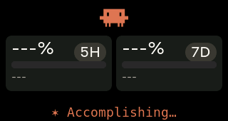
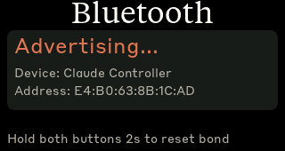

# Clawdmeter — LilyGO T-Display S3 fork

> **Fork notice.** This repository is a fork of [HermannBjorgvin/Clawdmeter](https://github.com/HermannBjorgvin/Clawdmeter)
> — the original project, which targets the **Waveshare ESP32-S3-Touch-AMOLED-2.16**. Everything good about Clawdmeter (the
> concept, the daemon, the pixel-art splash, the brand work, the BLE/HID architecture) is Hermann's work.
> This fork exists only because I had a **LilyGO T-Display S3** on my desk instead of the Waveshare board, and porting the
> firmware to it required a separate display driver, layout, and input model. Please star
> [the original repo](https://github.com/HermannBjorgvin/Clawdmeter) if you find this project useful.

A small ESP32 dashboard for my desk to keep an eye on Claude Code usage. The original ran on
the [Waveshare ESP32-S3-Touch-AMOLED-2.16](https://docs.waveshare.com/ESP32-S3-Touch-AMOLED-2.16); this fork adds support
for the [LilyGO T-Display S3](https://lilygo.cc/products/t-display-s3) (1.9" 170×320 ST7789 IPS) and runs in landscape at 320×170.

It pairs with my laptop over Bluetooth, the splash screen plays pixel-art Clawd animations that get busier when your usage rate climbs,
and the two side buttons send Space and Shift+Tab over BLE HID for Claude Code's voice mode and mode-toggle shortcuts.

|              Usage meter              |              Clawd animation screen              |
| :-----------------------------------: | :----------------------------------------------: |
|       |        |

> The demo media above is from Hermann's original 480×480 AMOLED build — the T-Display fork shows the same content in landscape on the smaller panel.

The Clawd animations come from [claudepix](https://claudepix.vercel.app), [@amaanbuilds](https://x.com/amaanbuilds)'s library of pixel-art Clawd sprites — check it out, it's lovely.

## Screens (T-Display S3, 320×170 landscape)

The device boots into the splash. From the splash, a long-press on the **bottom** button cycles to the Usage screen; the **top** button long-press cycles Usage ↔ Bluetooth ↔ Splash from then on.

|              Splash                              |              Usage                            |                Bluetooth                            |
| :----------------------------------------------: | :-------------------------------------------: | :-------------------------------------------------: |
|        |       |     |
| Splash; long-press top button to leave           | Session and weekly utilization                | Connection status; hold both buttons 2s to reset    |

For the original 480×480 AMOLED layout, see [Hermann's repo](https://github.com/HermannBjorgvin/Clawdmeter) — its screenshots are also still in [`screenshots/`](screenshots/) (`splash.png`, `usage.png`, `bluetooth.png`).

While the splash is up, the bottom button cycles animations instead of toggling the splash overlay. The firmware also auto-rotates every 20 s within the current usage-rate group, so a long stretch on the splash isn't just one Clawd on loop.

## Hardware

This fork targets the **LilyGO T-Display S3** (N16R8 — 16 MB Flash + 8 MB OPI PSRAM, ESP32-S3R8):

- 1.9" 170×320 ST7789 IPS, 8-bit i80 parallel
- Two physical buttons (top: GPIO 0, bottom: GPIO 14 — assignment is landscape-orientation-dependent; see `display_cfg_tdisplay.h`)
- USB-C for flashing
- No touch, no IMU, no PMU — the original board has all three and uses them; this fork drops them entirely

The original board is the [Waveshare ESP32-S3-Touch-AMOLED-2.16](https://docs.waveshare.com/ESP32-S3-Touch-AMOLED-2.16). Both build environments live in the same `firmware/` tree and pick their board-specific source files via `build_src_filter`. Pick the env that matches your hardware.

## Prerequisites

- macOS or Linux
- [PlatformIO CLI](https://docs.platformio.org/en/latest/core/installation/index.html) — `pipx install platformio` on macOS, see PlatformIO's docs for Linux
- Daemon dependencies:
  - **macOS** — Python 3.9+, `bleak` (auto-installed into a local venv by `install-macos.sh`)
  - **Linux** — `curl`, `awk`, `bluetoothctl`, `busctl` (BlueZ stack)
- Claude Code with an active subscription

## Flash the firmware

LilyGO T-Display S3:

```bash
pio run -d firmware -e lilygo_tdisplay_s3 -t upload --upload-port /dev/cu.usbmodem* # macOS
pio run -d firmware -e lilygo_tdisplay_s3 -t upload --upload-port /dev/ttyACM0      # Linux
```

Original Waveshare AMOLED:

```bash
pio run -d firmware -e waveshare_amoled_216 -t upload --upload-port /dev/ttyACM0
```

## Pair the device

After flashing, the device advertises as "Claude Controller". You do not need to manually pair it — the daemon scans by name on first run and caches the device address for fast reconnects. Just keep the device powered and showing the Bluetooth screen the first time you start the daemon.

On macOS, the first BLE write will trigger a permission prompt — approve it under **System Settings → Privacy & Security → Bluetooth** for the `python3` inside `daemon-macos/.venv/bin`.

## Install the daemon

The daemon reads your Claude Code OAuth token, polls your usage every 60 seconds, and sends it to the device over BLE.

### macOS (this fork)

```bash
./install-macos.sh
```

The installer creates an isolated Python venv under `daemon-macos/.venv`, installs `bleak`, generates a `launchd` agent (`~/Library/LaunchAgents/com.clawdmeter.daemon.plist`), and loads it. The agent auto-starts at every login.

Logs:

```bash
tail -f ~/Library/Logs/Clawdmeter/clawdmeter.out.log
```

Manage:

```bash
launchctl kickstart -k gui/$(id -u)/com.clawdmeter.daemon   # restart
launchctl bootout   gui/$(id -u)/com.clawdmeter.daemon      # stop & unload
```

The macOS daemon reads the OAuth token from the **Keychain** (`Claude Code-credentials`), not from a file — that's where the Claude Code app stores it on macOS.

### Linux (original)

```bash
./install.sh
systemctl --user start claude-usage-daemon
```

Check status: `systemctl --user status claude-usage-daemon`

View logs: `journalctl --user -u claude-usage-daemon -f`

The Linux daemon reads the OAuth token from `~/.claude/.credentials.json`.

## How it works

1. The daemon reads your Claude Code OAuth token from `~/.claude/.credentials.json`.
2. It makes a minimal API call to `api.anthropic.com/v1/messages` — one token of Haiku, basically free.
3. The usage numbers come straight out of the response headers (`anthropic-ratelimit-unified-5h-utilization` and friends).
4. The daemon connects to the ESP32 over BLE and writes a JSON payload to the GATT RX characteristic.
5. The firmware parses it and updates the LVGL dashboard.
6. The firmware also tracks the rate of change of session % over a 5-minute window and picks splash animations from the matching mood group.
7. The two side buttons are independent of all of this — they send Space and Shift+Tab as BLE HID keyboard input to the paired host directly.

## Physical buttons (T-Display S3)

The T-Display S3 has two side buttons. In landscape (USB-C on the right) the BOOT button is on top and the user button is on the bottom. Each has a short-press and a long-press action.

| Button     | GPIO    | Short tap                                              | Long press (≥ 600 ms)                                    |
| ---------- | ------- | ------------------------------------------------------ | -------------------------------------------------------- |
| **Top**    | GPIO 0  | Space (Claude Code voice-mode toggle)                  | Cycle screen (Usage ↔ Bluetooth ↔ Splash)                |
| **Bottom** | GPIO 14 | Shift+Tab (Claude Code mode toggle)                    | On Splash: next animation. Elsewhere: toggle Splash      |

Hold **both buttons together for 2 seconds** to clear BLE bonds (this replaces the on-screen "Reset Bluetooth" touch zone on the AMOLED version).

Space and Shift+Tab go out as standard BLE HID keyboard reports, so they trigger in whatever window has focus on the paired host — not just Claude Code.

The original AMOLED has three buttons (Left/Middle/Right) — see [Hermann's README](https://github.com/HermannBjorgvin/Clawdmeter#physical-buttons) for that mapping.

## BLE protocol

The device advertises a custom GATT service alongside the standard HID keyboard service:

|                            | UUID                                   |
| -------------------------- | -------------------------------------- |
| **Data Service**           | `4c41555a-4465-7669-6365-000000000001` |
| RX Characteristic (write)  | `4c41555a-4465-7669-6365-000000000002` |
| TX Characteristic (notify) | `4c41555a-4465-7669-6365-000000000003` |
| **HID Service**            | `00001812-0000-1000-8000-00805f9b34fb` |

JSON payload format (written to RX):

```json
{ "s": 45, "sr": 120, "w": 28, "wr": 7200, "st": "allowed", "ok": true }
```

Fields: `s` = session %, `sr` = session reset (minutes), `w` = weekly %, `wr` = weekly reset (minutes), `st` = status, `ok` = success flag.

## Recompiling fonts

The `firmware/src/font_*.c` files are pre-compiled LVGL bitmap fonts. The AMOLED build uses the larger sizes (tiempos_56, styrene_48/28/24/20, mono_32) to suit its 314 PPI panel; the T-Display build uses the smaller ladder (tiempos_34, styrene_24/14, mono_18) to suit its tighter 320×170 frame.

```bash
npm install -g lv_font_conv
```

Generate each one (one at a time — `lv_font_conv` doesn't like loop-driven invocations) with `--no-compress` (required for LVGL 9):

```bash
# Tiempos Text (titles — 56 for AMOLED, 34 for T-Display)
for size in 56 34; do
  lv_font_conv --font assets/TiemposText-400-Regular.otf -r 0x20-0x7E \
    --size $size --format lvgl --bpp 4 --no-compress \
    -o firmware/src/font_tiempos_${size}.c --lv-include "lvgl.h"
done

# Styrene B (large numbers, panel labels, small text)
for size in 48 28 24 20 16 14 12; do
  lv_font_conv --font assets/StyreneB-Regular.otf -r 0x20-0x7E \
    --size $size --format lvgl --bpp 4 --no-compress \
    -o firmware/src/font_styrene_${size}.c --lv-include "lvgl.h"
done

# DejaVu Sans Mono (32 for AMOLED, 18 for T-Display — both need spinner Unicode chars)
for size in 32 18; do
  lv_font_conv --font assets/DejaVuSansMono.ttf \
    -r 0x20-0x7E,0xB7,0x2026,0x2722,0x2733,0x2736,0x273B,0x273D \
    --size $size --format lvgl --bpp 4 --no-compress \
    -o firmware/src/font_mono_${size}.c --lv-include "lvgl.h"
done
```

**Important:** `lv_font_conv` v1.5.3 outputs LVGL 8 format. Each generated file must be patched for LVGL 9 compatibility:

1. Remove `#if LVGL_VERSION_MAJOR >= 8` guards around `font_dsc` and the font struct
2. Remove the `.cache` field from `font_dsc`
3. Add `.release_glyph = NULL`, `.kerning = 0`, `.static_bitmap = 0` to the font struct
4. Add `.fallback = NULL`, `.user_data = NULL` to the font struct

Without these patches, fonts compile but render as invisible.

## Converting Lucide icons

The UI uses a small set of [Lucide](https://lucide.dev) icons (bluetooth + battery states) converted to RGB565 / RGB565A8 C arrays for LVGL. The T-Display build doesn't use the battery icons (no battery hardware) but they remain in `icons.h` for the AMOLED build.

```bash
node tools/png_to_lvgl.js assets/icon_bluetooth_48.png icon_bluetooth_data ICON_BLUETOOTH_WIDTH ICON_BLUETOOTH_HEIGHT
```

Default tint is white (`0xFFFFFF`); Lucide PNGs ship as black-on-transparent and would render invisible against the dark UI without it. Pass `--no-tint` for pre-coloured artwork like the logo. Battery icons use RGB565A8 (alpha plane) so they blend cleanly over the splash; the rest are baked RGB565 over the panel colour. Paste the converter output into `firmware/src/icons.h`.

## Splash animations

The animations come from [claudepix.vercel.app](https://claudepix.vercel.app),
a library of Clawd sprites. `tools/scrape_claudepix.js` evaluates the
site's JavaScript in a Node VM to pull out frame data and palettes, then
`tools/convert_to_c.js` turns everything into RGB565 C arrays and writes
`firmware/src/splash_animations.h`.

To re-pull (e.g. when the source library updates):

```bash
node tools/scrape_claudepix.js
node tools/convert_to_c.js
pio run -d firmware -e lilygo_tdisplay_s3 -t upload   # or -e waveshare_amoled_216
```

See `tools/README.md` for details.

## Credits

- **Original project, design, and ongoing work**: [Hermann Bjorgvin](https://github.com/HermannBjorgvin) ([HermannBjorgvin/Clawdmeter](https://github.com/HermannBjorgvin/Clawdmeter)). Every architectural decision in this fork is downstream of his.
- **Pixel-art Clawd animation** by [@amaanbuilds](https://x.com/amaanbuilds), sourced from [claudepix.vercel.app](https://claudepix.vercel.app). Frame data and palettes scraped + converted by the tooling in `tools/`.
- **Lucide icon set** ([lucide.dev](https://lucide.dev), MIT) for bluetooth and battery UI glyphs.
- **Anthropic brand fonts** (Tiempos Text, Styrene B) — see licensing warning below.
- **T-Display S3 port** in this fork: [@bperlman](https://github.com/bperlman).

## Licensing gray area warning

The software in this repository uses and adheres to the Anthropic brand guidelines and uses the same proprietary fonts that Anthropic has a licnese for but this software uses without permission as well as using assets from Anthropic such as the copyrighted Clawd mascot so even though the code in this repo is non-proprietary I will not license it myself under a copyleft license since this repo includes proprietary fonts and copyrighted assets. Please be aware of this if you fork or copy the code from this repo. **You have been warned!**
